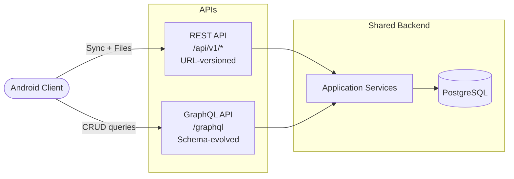

# API Versioning

Versioning policy for the Day Keeper REST and GraphQL APIs.

## Versioning Scheme

REST endpoints use **URL path segment versioning**:

```text
/api/v{major}/{controller}/{action}
```

Examples:

- `POST /api/v1/sync/pull`
- `POST /api/v1/sync/push`
- `POST /api/v1/attachments`

Configuration in `Program.cs`:

```csharp
builder.Services
    .AddApiVersioning(options =>
    {
        options.DefaultApiVersion = new ApiVersion(1, 0);
        options.AssumeDefaultVersionWhenUnspecified = true;
        options.ReportApiVersions = true;   // adds api-supported-versions header
    })
    .AddMvc()
    .AddApiExplorer(options =>
    {
        options.GroupNameFormat = "'v'VVV";
        options.SubstituteApiVersionInUrl = true;
    });
```

Each controller declares its version via `[ApiVersion(1.0)]` and uses the
route template `api/v{version:apiVersion}/[controller]`.

## Current API Surface

| API     | Version | Endpoint                | Purpose                            |
| ------- | ------- | ----------------------- | ---------------------------------- |
| REST    | v1      | `/api/v1/sync/*`        | Offline-first mobile sync protocol |
| REST    | v1      | `/api/v1/attachments/*` | File upload/download               |
| GraphQL | &mdash; | `/graphql`              | Full CRUD on all domain entities   |

GraphQL is not URL-versioned. See [GraphQL vs REST](#graphql-vs-rest)
below.

## When to Bump Versions

### REST (major version bump)

Create a new major version (`v2`) when making **breaking changes**:

- Removing or renaming fields in request/response bodies
- Changing the semantics of an existing field
- Removing an endpoint
- Changing error response structure

**Non-breaking** changes do not require a version bump:

- Adding new optional fields to requests
- Adding new fields to responses
- Adding new endpoints under the same version
- Adding new enum values (when clients handle unknown values gracefully)

### GraphQL

GraphQL does not use URL versioning. Evolve the schema using:

- Add new fields, types, and mutations freely
- Mark deprecated items with `@deprecated(reason: "...")` before removal
- Remove deprecated items only after the deprecation window (see below)

## Backward Compatibility

Within a version:

1. **Existing fields keep their meaning.** Never change the type or
   semantics of a field within the same version.
2. **Additive only.** New fields and endpoints are fine; removals or
   renames require a new major version.
3. **Defaults are stable.** If a field has a default value, it does not
   change within the same version.

## Deprecation Policy

When removing or replacing functionality:

1. **Announce** the deprecation in release notes and (for GraphQL) via
   the `@deprecated` directive.
2. **Support window** &mdash; maintain the deprecated version for at
   least **two release cycles** after the replacement is available.
3. **Sunset header** &mdash; REST responses for deprecated versions
   should include a `Sunset` HTTP header with the planned removal date
   ([RFC 8594](https://datatracker.ietf.org/doc/html/rfc8594)).
4. **Remove** the deprecated version in the next major release after
   the support window closes.

## GraphQL vs REST



- **REST** is versioned via URL path segments. Each major version is a
  separate set of endpoints. Used for sync and binary file operations
  where REST semantics are a better fit.
- **GraphQL** is unversioned. The schema evolves additively with
  `@deprecated` annotations. Used for all CRUD operations where clients
  benefit from flexible queries and type safety.
- Both APIs share the same Application and Infrastructure layers, so
  business logic is never duplicated.

## Android Client Version Negotiation

The Android client should follow this strategy:

1. **Target a specific version** in the base URL
   (e.g., `https://api.example.com/api/v1/`).
2. **Read response headers** &mdash; `api-supported-versions` lists all
   available versions (e.g., `1.0, 2.0`). This header is automatically
   included because `ReportApiVersions = true`.
3. **Detect deprecation** &mdash; if a `Sunset` header is present, warn
   the user or schedule an upgrade.
4. **Upgrade path** &mdash; when a new major version is available, ship
   an app update that targets the new version. Old app versions continue
   working until the sunset date.
5. **GraphQL** &mdash; no version negotiation needed. The client should
   handle unknown fields gracefully and check for `@deprecated` warnings
   in tooling.
