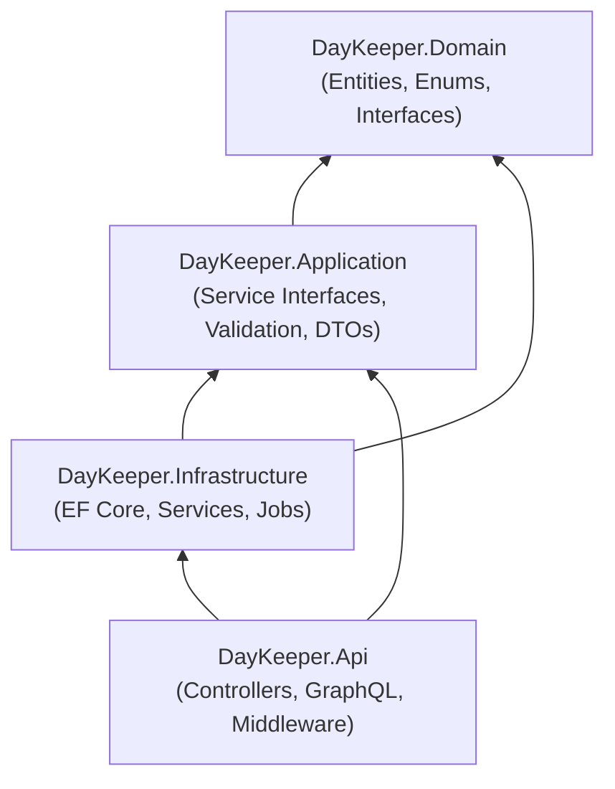
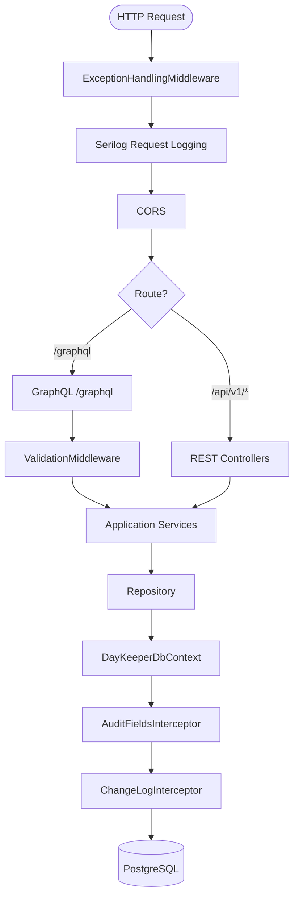
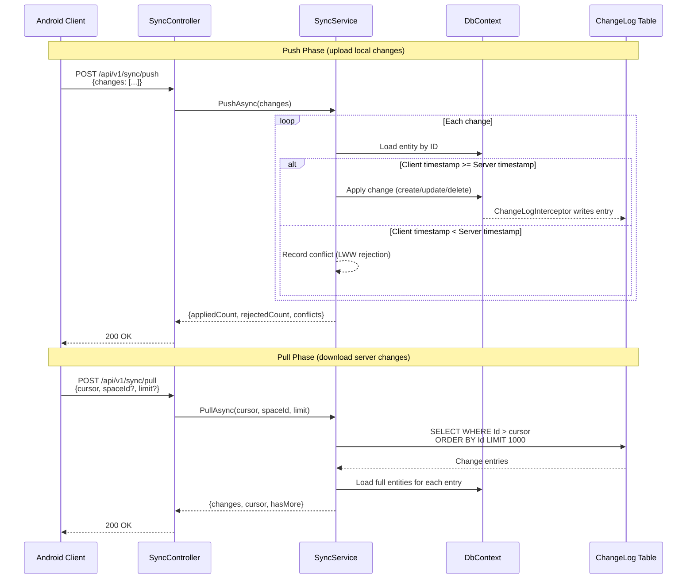
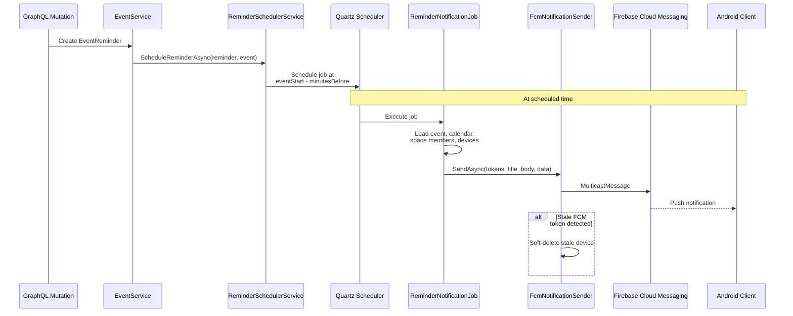
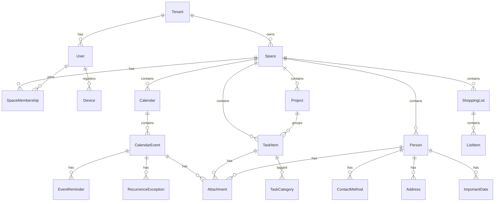
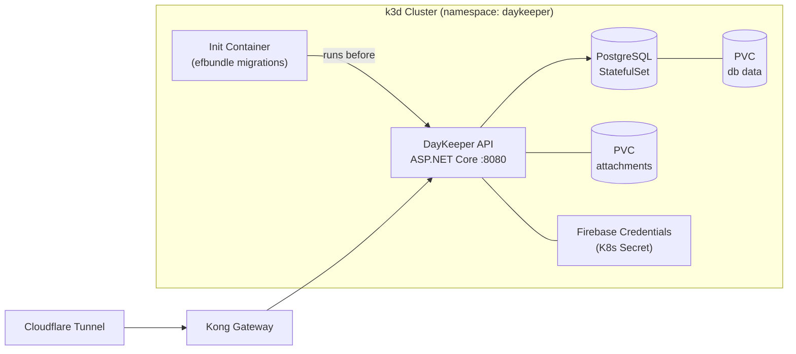

# Architecture

Living architecture reference for the Day Keeper service.
For the original design plan and rationale, see [day-keeper-plan.md](day-keeper-plan.md).

## Clean Architecture Layers

**Dependency rule:** each layer only depends on the layers below it.

### Domain

Zero external dependencies. Contains:

- **Entities** &mdash; All inherit from `BaseEntity` (Id, CreatedAt, UpdatedAt,
  DeletedAt soft-delete). Core models: `Tenant`, `User`, `Space`,
  `SpaceMembership`, `Calendar`, `CalendarEvent`, `EventReminder`,
  `RecurrenceException`, `TaskItem`, `Project`, `Person`, `ContactMethod`,
  `Address`, `ImportantDate`, `ShoppingList`, `ListItem`, `Attachment`,
  `Device`, `ChangeLog`.
- **Enums** &mdash; `SpaceRole`, `SpaceType`, `TaskItemStatus`,
  `TaskItemPriority`, `ReminderMethod`, `ContactMethodType`,
  `DevicePlatform`, `WeekStart`, `ChangeLogEntityType`, `ChangeOperation`.
- **Interfaces** &mdash; `ITenantScoped` (required TenantId),
  `IOptionalTenantScoped` (nullable TenantId for system spaces).

### Application

References Domain only. Contains:

- **Service interfaces** &mdash; `ITenantService`, `IUserService`,
  `ISpaceService`, `ICalendarService`, `IEventService`, `ITaskItemService`,
  `IPersonService`, `IShoppingListService`, `IAttachmentService`,
  `IDeviceService`, `ISyncService`, `IRecurrenceExpander`,
  `INotificationSender`, `IReminderSchedulerService`, `IDateTimeProvider`,
  `IAttachmentStorageService`, `IRepository<T>`.
- **Validation** &mdash; FluentValidation command records
  (`CreateTenantCommand`, `UpdateCalendarEventCommand`, etc.) and their
  validators.
- **DTOs** &mdash; Sync protocol payloads (`SyncPullRequest`,
  `SyncPullResponse`, `SyncPushRequest`, `SyncPushResponse`,
  `SyncChangeEntry`, `SyncConflict`).
- **Exceptions** &mdash; `EntityNotFoundException`,
  `BusinessRuleViolationException`, `InputValidationException`,
  `DuplicateSlugException`, and other domain-specific errors.

### Infrastructure

References Domain and Application. Contains:

- **Persistence** &mdash; `DayKeeperDbContext` with Npgsql, tenant-scoped
  query filters, and soft-delete filters. Entity configurations follow the
  `BaseEntityConfiguration<T>` pattern (auto-discovered via
  `ApplyConfigurationsFromAssembly`). Interceptors: `AuditFieldsInterceptor`
  (timestamps), `ChangeLogInterceptor` (append-only mutation journal).
  Generic `Repository<T>`.
- **Services** &mdash; Implementations of all Application interfaces
  including `SyncService` (cursor-based sync with LWW conflict resolution),
  `FcmNotificationSender` (Firebase Cloud Messaging),
  `IcalNetRecurrenceExpander` (iCalendar RRULE expansion),
  `ReminderSchedulerService` (Quartz job scheduling).
- **Jobs** &mdash; `ReminderNotificationJob` (Quartz job that dispatches
  push notifications at reminder time).

### Api

References Application and Infrastructure. Contains:

- **REST controllers** &mdash; `SyncController`
  (`/api/v1/sync/pull`, `/api/v1/sync/push`), `AttachmentsController`
  (`/api/v1/attachments`).
- **GraphQL** &mdash; Hot Chocolate server at `/graphql` with query and
  mutation type extensions for every domain entity. Cursor pagination
  (default 25, max 100), filtering, sorting, projections.
- **Validation pipeline** &mdash; `ValidationTypeInterceptor` auto-wires
  `ValidationMiddleware` into mutations; `InputFactory` maps GraphQL
  arguments to FluentValidation commands.
- **Error handling** &mdash; `ExceptionHandlingMiddleware` (REST),
  `DomainErrorFilter` (GraphQL).
- **Tenant context** &mdash; `HttpTenantContext` resolves tenant from
  `X-Tenant-Id` header (JWT claims planned).

## Request Lifecycle

## Sync Flow

The sync protocol uses a monotonic cursor (auto-increment `ChangeLog.Id`)
for efficient incremental synchronization. See
[SYNC-PROTOCOL.md](SYNC-PROTOCOL.md) for the full specification.

## Notification Flow

Event reminders are scheduled as Quartz jobs and delivered via Firebase
Cloud Messaging.

## Database Schema Overview

All tables share a common pattern: client-generated UUID primary keys,
`created_at`/`updated_at` audit timestamps, and `deleted_at` for
soft-deletes.

The `ChangeLog` table is an append-only journal with an auto-increment
`Id` (used as the sync cursor), `EntityType`, `EntityId`, `Operation`,
`Timestamp`, `TenantId`, and `SpaceId`.

## Deployment Topology

The API container runs as non-root (UID 10654) with a read-only root
filesystem. Liveness (`/health/live`), readiness (`/health/ready`), and
startup probes ensure rolling updates are safe.
