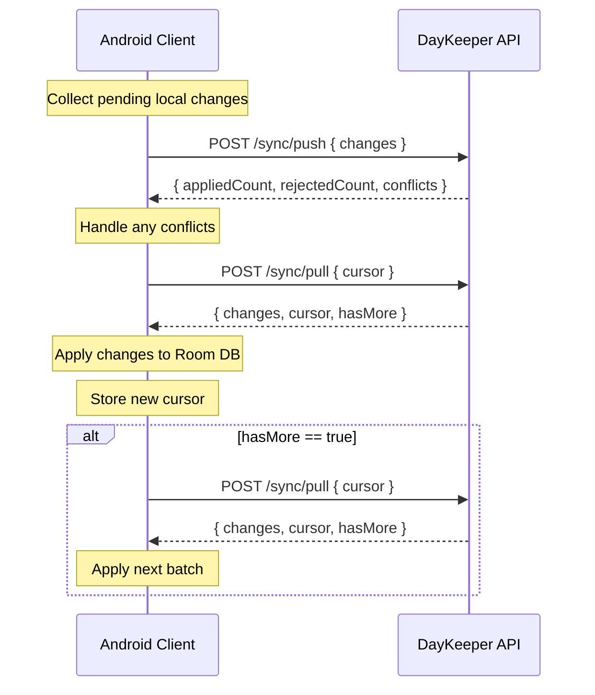
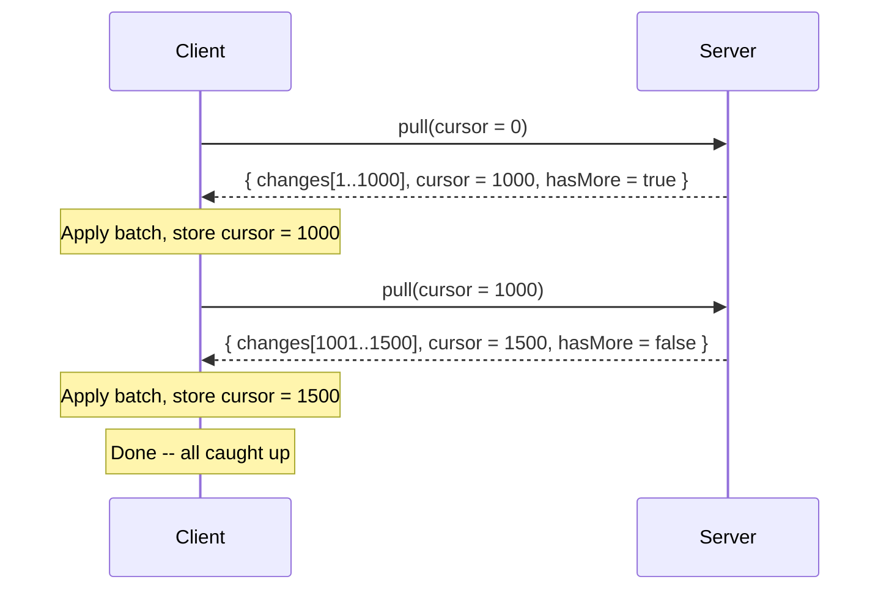
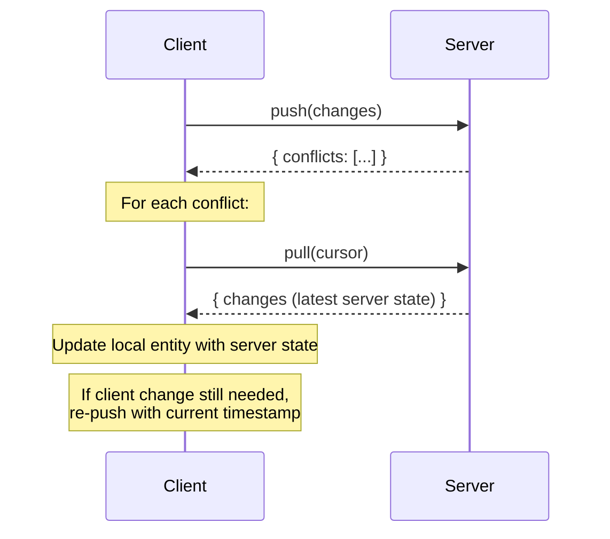
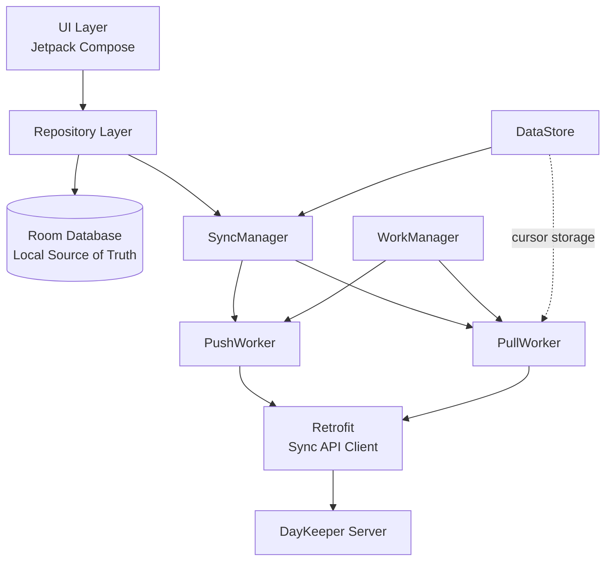
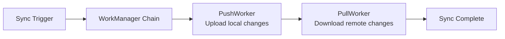

<!-- markdownlint-disable MD013 -->

# Sync Protocol

**Status:** Accepted
**Date:** 2026-03-07
**Task:** day-keeper-service-f5r

---

## Table of Contents

1. [Protocol Overview](#1-protocol-overview)
2. [Endpoint Contracts](#2-endpoint-contracts)
3. [Change Log and Cursor Mechanics](#3-change-log-and-cursor-mechanics)
4. [Tombstone and Soft-Delete Behavior](#4-tombstone-and-soft-delete-behavior)
5. [Conflict Resolution (Last-Write-Wins)](#5-conflict-resolution-last-write-wins)
6. [Entity Types and Sync Order](#6-entity-types-and-sync-order)
7. [Serialization Format](#7-serialization-format)
8. [Client Implementation Guide (Android)](#8-client-implementation-guide-android)

---

## 1. Protocol Overview

DayKeeper uses an **offline-first** architecture. The Android client operates against a local Room (SQLite) database and synchronizes with the server in the background. The sync protocol is REST-based with two operations:

- **Push** -- upload local changes to the server
- **Pull** -- download remote changes from the server

Sync uses a **monotonic cursor** (an auto-incrementing `long` from the server's change log) to track progress. The client stores a single cursor value and sends it on each pull to receive only new changes.

### Sync Cycle

Every sync session follows a **push-then-pull** order:



> **Why push first?** Pushing first ensures the server has the client's latest state before the client pulls. This prevents the client from pulling its own changes back and reduces unnecessary conflict detection.

---

## 2. Endpoint Contracts

All sync endpoints require authentication. The base URL is:

```text
POST /api/v1/sync/{operation}
```

### 2.1 Pull -- `POST /api/v1/sync/pull`

Downloads changes from the server since the client's last known cursor.

#### Request Body

| Field     | Type            | Required | Default | Description                                             |
| --------- | --------------- | -------- | ------- | ------------------------------------------------------- |
| `cursor`  | `long?`         | No       | `0`     | Last-seen change log ID. `null` fetches from beginning. |
| `spaceId` | `string` (UUID) | No       | `null`  | Filter changes to a single space.                       |
| `limit`   | `int?`          | No       | `1000`  | Page size. Clamped to range `[1, 1000]`.                |

#### Response Body

| Field     | Type                         | Description                                                 |
| --------- | ---------------------------- | ----------------------------------------------------------- |
| `changes` | `array` of `SyncChangeEntry` | Changed entities, ordered by cursor ID ascending.           |
| `cursor`  | `long`                       | New cursor value. Store this locally for the next pull.     |
| `hasMore` | `bool`                       | `true` if more changes exist beyond this batch. Pull again. |

#### SyncChangeEntry

| Field        | Type                | Description                                                     |
| ------------ | ------------------- | --------------------------------------------------------------- |
| `id`         | `long`              | Change log ID (this is the cursor value).                       |
| `entityType` | `string`            | Entity type (camelCase enum, e.g. `"calendar"`, `"taskItem"`).  |
| `entityId`   | `string` (UUID)     | Primary key of the changed entity.                              |
| `operation`  | `string`            | `"created"`, `"updated"`, or `"deleted"`.                       |
| `timestamp`  | `string` (ISO 8601) | UTC timestamp of the change.                                    |
| `data`       | `object?`           | Full entity JSON for `created`/`updated`. `null` for `deleted`. |

#### Example

**Request:**

```json
{
  "cursor": 42,
  "spaceId": null,
  "limit": 100
}
```

**Response:**

```json
{
  "changes": [
    {
      "id": 43,
      "entityType": "calendar",
      "entityId": "a1b2c3d4-e5f6-7890-abcd-ef1234567890",
      "operation": "created",
      "timestamp": "2026-03-07T10:30:00Z",
      "data": {
        "id": "a1b2c3d4-e5f6-7890-abcd-ef1234567890",
        "spaceId": "11111111-2222-3333-4444-555555555555",
        "name": "Work",
        "normalizedName": "work",
        "color": "#4285F4",
        "isDefault": false,
        "createdAt": "2026-03-07T10:30:00Z",
        "updatedAt": "2026-03-07T10:30:00Z"
      }
    },
    {
      "id": 44,
      "entityType": "calendarEvent",
      "entityId": "deadbeef-dead-beef-dead-beefdeadbeef",
      "operation": "deleted",
      "timestamp": "2026-03-07T10:31:00Z",
      "data": null
    }
  ],
  "cursor": 44,
  "hasMore": false
}
```

### 2.2 Push -- `POST /api/v1/sync/push`

Uploads local changes to the server. The server applies last-write-wins conflict resolution.

#### Push Request Body

| Field     | Type                       | Description              |
| --------- | -------------------------- | ------------------------ |
| `changes` | `array` of `SyncPushEntry` | Client changes to apply. |

#### SyncPushEntry

| Field        | Type                | Description                                                   |
| ------------ | ------------------- | ------------------------------------------------------------- |
| `entityType` | `string`            | Entity type (camelCase enum).                                 |
| `entityId`   | `string` (UUID)     | Client-generated UUID (for creates) or existing entity ID.    |
| `operation`  | `string`            | `"created"`, `"updated"`, or `"deleted"`.                     |
| `timestamp`  | `string` (ISO 8601) | Client-side mutation time (UTC). Used for LWW comparison.     |
| `data`       | `object?`           | Full entity body for `created`/`updated`. Omit for `deleted`. |

#### Push Response Body

| Field           | Type                      | Description                                 |
| --------------- | ------------------------- | ------------------------------------------- |
| `appliedCount`  | `int`                     | Number of changes successfully applied.     |
| `rejectedCount` | `int`                     | Number of changes rejected due to conflict. |
| `conflicts`     | `array` of `SyncConflict` | Details for each rejected change.           |

#### SyncConflict

| Field             | Type                | Description                            |
| ----------------- | ------------------- | -------------------------------------- |
| `entityType`      | `string`            | Entity type of the conflicting change. |
| `entityId`        | `string` (UUID)     | ID of the conflicting entity.          |
| `clientTimestamp` | `string` (ISO 8601) | The client's rejected timestamp.       |
| `serverTimestamp` | `string` (ISO 8601) | The server's winning timestamp.        |

#### Push Example

**Request:**

```json
{
  "changes": [
    {
      "entityType": "calendarEvent",
      "entityId": "aaaaaaaa-bbbb-cccc-dddd-eeeeeeeeeeee",
      "operation": "created",
      "timestamp": "2026-03-07T12:00:00Z",
      "data": {
        "id": "aaaaaaaa-bbbb-cccc-dddd-eeeeeeeeeeee",
        "calendarId": "a1b2c3d4-e5f6-7890-abcd-ef1234567890",
        "title": "Team Standup",
        "isAllDay": false,
        "startAt": "2026-03-08T09:00:00Z",
        "endAt": "2026-03-08T09:30:00Z",
        "createdAt": "2026-03-07T12:00:00Z",
        "updatedAt": "2026-03-07T12:00:00Z"
      }
    },
    {
      "entityType": "taskItem",
      "entityId": "99999999-8888-7777-6666-555555555555",
      "operation": "updated",
      "timestamp": "2026-03-07T11:50:00Z",
      "data": {
        "id": "99999999-8888-7777-6666-555555555555",
        "spaceId": "11111111-2222-3333-4444-555555555555",
        "title": "Buy groceries",
        "status": "completed",
        "completedAt": "2026-03-07T11:50:00Z",
        "createdAt": "2026-03-06T08:00:00Z",
        "updatedAt": "2026-03-07T11:50:00Z"
      }
    }
  ]
}
```

**Response (one applied, one conflict):**

```json
{
  "appliedCount": 1,
  "rejectedCount": 1,
  "conflicts": [
    {
      "entityType": "taskItem",
      "entityId": "99999999-8888-7777-6666-555555555555",
      "clientTimestamp": "2026-03-07T11:50:00Z",
      "serverTimestamp": "2026-03-07T11:55:00Z"
    }
  ]
}
```

---

## 3. Change Log and Cursor Mechanics

The server maintains an append-only `change_log` table that records every entity mutation. Its auto-incrementing `Id` column serves as the **monotonic cursor**.

### How the Cursor Works

| Property      | Value                                                       |
| ------------- | ----------------------------------------------------------- |
| Type          | `long` (64-bit integer)                                     |
| Generation    | Auto-increment primary key (database-assigned)              |
| Direction     | Strictly increasing -- never resets, never goes backwards   |
| Initial value | `null` or `0` means "give me everything from the beginning" |
| After pull    | Client stores the `cursor` value from the response          |

### Change Log Entry Fields

| Field        | Type       | Description                                     |
| ------------ | ---------- | ----------------------------------------------- |
| `Id`         | `long`     | Auto-increment PK. This is the cursor value.    |
| `EntityType` | `enum`     | Which entity type changed (see section 6).      |
| `EntityId`   | `Guid`     | Primary key of the changed entity.              |
| `Operation`  | `enum`     | `Created` (0), `Updated` (1), or `Deleted` (2). |
| `TenantId`   | `Guid?`    | Tenant scope. `null` for system entities.       |
| `SpaceId`    | `Guid?`    | Space scope. `null` for non-space entities.     |
| `Timestamp`  | `DateTime` | UTC timestamp of the change.                    |

### Recording

The `ChangeLogInterceptor` hooks into EF Core's `SaveChanges` pipeline and automatically writes a change log entry for every entity mutation. No manual tracking is required. Soft-deletes (setting `DeletedAt` from `null` to a value) are detected and recorded as `Deleted` operations.

### Pull Query Logic

The server applies these filters in order:

1. **Cursor filter:** `WHERE Id > cursor` (only changes newer than the client's cursor)
2. **Tenant filter:** `WHERE TenantId == currentTenant OR TenantId IS NULL` (includes system entities)
3. **Space filter (optional):** `WHERE SpaceId == requestedSpaceId`
4. **Order:** `ORDER BY Id ASC`
5. **Pagination:** fetches `limit + 1` rows; if the result count exceeds `limit`, `hasMore = true` and the extra row is trimmed

### Pagination Loop



### Cursor Guarantees

- The cursor **only moves forward**. A pull never returns a cursor lower than the one you sent.
- If no new changes exist, the response cursor equals the input cursor and `changes` is empty.
- Changes are ordered by `Id` ascending, which reflects causal order within a single database transaction.
- The cursor is **global** -- it covers all entity types. There is no per-entity-type cursor.

---

## 4. Tombstone and Soft-Delete Behavior

DayKeeper uses **soft-delete** for all entities. Rows are never physically removed from the database.

### How It Works

- Every entity inherits from `BaseEntity`, which provides a `DeletedAt` (`DateTime?`) column.
- Setting `DeletedAt` to a non-null UTC timestamp marks the entity as deleted.
- `IsDeleted` is a computed property (`DeletedAt.HasValue`) -- it is **not** persisted or synced.
- Normal queries automatically exclude soft-deleted entities via global query filters.

### Sync Behavior

| Scenario                   | Behavior                                                                                                                |
| -------------------------- | ----------------------------------------------------------------------------------------------------------------------- |
| **Pull: deleted entity**   | `operation = "deleted"`, `data = null`. The client only needs `entityType` + `entityId` to know what to remove locally. |
| **Push: delete request**   | Client sends `operation = "deleted"` with `data` omitted. Server sets `DeletedAt = utcNow` on the entity.               |
| **Push: already deleted**  | If the entity is already deleted on the server, the push returns **success** (not a conflict). Deletes are idempotent.  |
| **Push: entity not found** | If the entity doesn't exist on the server, the push returns success. Nothing to delete.                                 |

### Client Handling

When receiving a `deleted` change via pull:

- Delete the entity from the local Room database (or mark it as deleted locally).
- Cascade local cleanup if needed (e.g., removing child entities like reminders for a deleted event).

> **Note:** All server-side foreign keys use `CASCADE` delete behavior. When a parent is deleted, children are automatically soft-deleted and each gets its own change log entry. The client will receive separate `deleted` entries for parent and children.

---

## 5. Conflict Resolution (Last-Write-Wins)

The server uses a **last-write-wins (LWW)** strategy based on timestamps.

### Algorithm

For each change in a push request:

1. Look up the most recent change log entry for `(entityType, entityId)` on the server.
2. Compare timestamps:

- If `clientTimestamp >= serverTimestamp` (or no server record exists): **client wins**. The change is applied.
- If `clientTimestamp < serverTimestamp`: **server wins**. The change is rejected as a conflict.

### Conflict Response

Rejected changes are returned in `SyncPushResponse.conflicts` with both timestamps:

```json
{
  "entityType": "taskItem",
  "entityId": "99999999-8888-7777-6666-555555555555",
  "clientTimestamp": "2026-03-07T11:50:00Z",
  "serverTimestamp": "2026-03-07T11:55:00Z"
}
```

### Recommended Client Handling



1. **Accept server version:** Pull the latest state and update the local entity. This is the simplest approach and recommended for most cases.
2. **Re-push with newer timestamp:** If the client's change must take priority, re-push with `timestamp` set to `DateTime.now()` (which will be newer than the server's timestamp).
3. **Merge:** For complex entities, manually merge fields from both versions and push the merged result.

### Edge Cases

> **Clock skew:** Always use UTC. Significant clock drift between client and server can cause unexpected conflicts. Consider calibrating against the server's `timestamp` values in pull responses.
>
> **Create-after-delete:** If an entity was deleted on the server and the client tries to create a new entity with the same ID, it may conflict. Always generate a fresh UUID for new entities.
>
> **Simultaneous edits:** If two clients edit the same entity, the first push wins. The second client receives a conflict and should pull the latest state before retrying.

---

## 6. Entity Types and Sync Order

The server tracks 21 entity types. Each is identified by a `ChangeLogEntityType` enum.

### Entity Type Reference

| Enum Value | Name                  | Parent FK(s)                                                | Space-Scoped |
| ---------- | --------------------- | ----------------------------------------------------------- | ------------ |
| 0          | `tenant`              | --                                                          | No           |
| 1          | `user`                | `tenantId`                                                  | No           |
| 2          | `space`               | `tenantId` (nullable for system spaces)                     | Yes (self)   |
| 3          | `spaceMembership`     | `spaceId`, `userId`                                         | Yes          |
| 4          | `calendar`            | `spaceId`                                                   | Yes          |
| 5          | `calendarEvent`       | `calendarId`, `eventTypeId` (optional)                      | No           |
| 6          | `eventType`           | `tenantId` (nullable for system types)                      | No           |
| 7          | `eventReminder`       | `calendarEventId`                                           | No           |
| 8          | `taskItem`            | `spaceId`, `projectId` (optional)                           | Yes          |
| 9          | `taskCategory`        | `taskItemId`, `categoryId`                                  | No           |
| 10         | `category`            | `tenantId` (nullable for system cats)                       | No           |
| 11         | `project`             | `spaceId`                                                   | Yes          |
| 12         | `person`              | `spaceId`                                                   | Yes          |
| 13         | `contactMethod`       | `personId`                                                  | No           |
| 14         | `address`             | `personId`                                                  | No           |
| 15         | `importantDate`       | `personId`, `eventTypeId` (optional)                        | No           |
| 16         | `shoppingList`        | `spaceId`                                                   | Yes          |
| 17         | `listItem`            | `shoppingListId`                                            | No           |
| 18         | `attachment`          | `calendarEventId` / `taskItemId` / `personId` (exactly one) | No           |
| 19         | `recurrenceException` | `calendarEventId`                                           | No           |
| 20         | `device`              | `userId`                                                    | No           |

### Recommended Push Order

When pushing changes, group them by **phase** to prevent foreign key violations. Push all entities in phase N before phase N+1.

| Phase | Entity Types                                                                                                    | Reason                                                                |
| ----- | --------------------------------------------------------------------------------------------------------------- | --------------------------------------------------------------------- |
| 1     | `tenant`, `eventType`, `category`                                                                               | Root/system-level. No FKs to other synced entities.                   |
| 2     | `space`, `user`                                                                                                 | Depend only on `tenant`.                                              |
| 3     | `spaceMembership`, `device`                                                                                     | Depend on `space` + `user` or `user`.                                 |
| 4     | `calendar`, `project`, `person`, `shoppingList`                                                                 | Depend on `space`.                                                    |
| 5     | `calendarEvent`, `taskItem`                                                                                     | Depend on `calendar` or `space` + optional `project`.                 |
| 6     | `eventReminder`, `recurrenceException`, `taskCategory`, `contactMethod`, `address`, `importantDate`, `listItem` | Depend on phase 4/5 entities.                                         |
| 7     | `attachment`                                                                                                    | Can reference multiple parent types (event, task, person). Push last. |

> **Pull order does not matter.** Pull returns changes in cursor order (chronological). The client should either apply them in dependency order locally, or disable Room FK enforcement during the sync transaction.

---

## 7. Serialization Format

All entity data in sync payloads follows these JSON conventions:

| Convention     | Rule                                                                |
| -------------- | ------------------------------------------------------------------- |
| Property names | **camelCase** (e.g., `spaceId`, `calendarId`, `isDefault`)          |
| Null values    | **Omitted** from output (not included as `"field": null`)           |
| Enums          | **camelCase strings** (e.g., `"personal"`, `"monday"`, `"created"`) |
| Dates          | **ISO 8601 UTC** (e.g., `"2026-03-07T15:00:00Z"`)                   |
| IDs            | **String UUIDs** (e.g., `"550e8400-e29b-41d4-a716-446655440000"`)   |

### Excluded Properties

The following are automatically excluded from entity `data` in sync payloads:

- **Navigation properties:** `calendar`, `space`, `events`, etc. (reference and collection navigations)
- **Computed properties:** `isDeleted`, `isSystem`

### Included Properties

All scalar/value properties are included:

- `id`, `createdAt`, `updatedAt`, `deletedAt`
- All entity-specific fields (e.g., `name`, `color`, `startAt`, `title`)
- Foreign key IDs (e.g., `spaceId`, `calendarId`, `personId`)

### Example: Serialized Calendar Entity

```json
{
  "id": "a1b2c3d4-e5f6-7890-abcd-ef1234567890",
  "spaceId": "11111111-2222-3333-4444-555555555555",
  "name": "Work",
  "normalizedName": "work",
  "color": "#4285F4",
  "isDefault": false,
  "createdAt": "2026-03-07T10:30:00Z",
  "updatedAt": "2026-03-07T10:30:00Z"
}
```

Note: `deletedAt` is omitted (null values are excluded). Navigation properties like `space` and `events` are excluded.

---

## 8. Client Implementation Guide (Android)

This section provides a practical guide for implementing the sync client in the Android app using Kotlin, Room, WorkManager, and Retrofit.

### 8.1 Architecture Overview



- **Room** is the local source of truth. The UI always reads from Room, never directly from the network.
- **WorkManager** handles background sync (survives app restarts, respects battery/network constraints).
- **Retrofit/OkHttp** handles HTTP communication with the sync endpoints.
- **DataStore** (or SharedPreferences) persists the sync cursor across app restarts.

### 8.2 Room Schema Considerations

#### Sync Status Tracking

Add a `syncStatus` column to each syncable entity table in Room. This column is **local only** -- it is never sent to the server.

```kotlin
enum class SyncStatus {
    SYNCED,           // Matches server state
    PENDING_CREATE,   // Created locally, not yet pushed
    PENDING_UPDATE,   // Modified locally, not yet pushed
    PENDING_DELETE    // Deleted locally, not yet pushed
}
```

#### Cursor Storage

Store the cursor as a single `Long` in DataStore:

```kotlin
val SYNC_CURSOR = longPreferencesKey("sync_cursor")
```

Or in a dedicated Room table:

```kotlin
@Entity(tableName = "sync_metadata")
data class SyncMetadata(
    @PrimaryKey val key: String,
    val value: Long
)
```

#### Client-Generated UUIDs

The server expects client-generated UUIDs for entity IDs. Generate them with `UUID.randomUUID()` when creating entities locally. Never reuse IDs from deleted entities.

### 8.3 WorkManager Integration



#### Periodic Background Sync

```kotlin
val syncWork = PeriodicWorkRequestBuilder<SyncWorker>(
    repeatInterval = 15, TimeUnit.MINUTES
)
    .setConstraints(
        Constraints.Builder()
            .setRequiredNetworkType(NetworkType.CONNECTED)
            .build()
    )
    .build()

WorkManager.getInstance(context).enqueueUniquePeriodicWork(
    "sync",
    ExistingPeriodicWorkPolicy.KEEP,
    syncWork
)
```

#### Immediate Sync (After User Action)

```kotlin
val immediatePush = OneTimeWorkRequestBuilder<PushWorker>()
    .setConstraints(networkConstraints)
    .build()

val immediatePull = OneTimeWorkRequestBuilder<PullWorker>()
    .setConstraints(networkConstraints)
    .build()

WorkManager.getInstance(context)
    .beginWith(immediatePush)
    .then(immediatePull)
    .enqueue()
```

#### SyncWorker Skeleton

```kotlin
class SyncWorker(
    context: Context,
    params: WorkerParameters,
    private val syncApi: SyncApi,
    private val db: AppDatabase,
    private val dataStore: DataStore<Preferences>
) : CoroutineWorker(context, params) {

    override suspend fun doWork(): Result {
        return try {
            pushChanges()
            pullChanges()
            Result.success()
        } catch (e: IOException) {
            Result.retry()  // Network error, WorkManager will retry
        } catch (e: HttpException) {
            if (e.code() in 500..599) Result.retry()
            else Result.failure()  // 4xx = client bug, don't retry
        }
    }
}
```

### 8.4 Push Implementation

Step-by-step:

1. **Query pending changes** from Room: all entities where `syncStatus != SYNCED`.
2. **Group by entity type.**
3. **Sort groups by push-order phase** (see section 6) to prevent FK violations.
4. **Build the request:** map each entity to a `SyncPushEntry` with its `entityType`, `entityId`, `operation`, `timestamp` (the `updatedAt` value), and `data` (serialized entity, omit for deletes).
5. **POST to `/api/v1/sync/push`.**
6. **Handle the response:** For applied changes, update `syncStatus = SYNCED` in Room. For conflicts, see section 5 for handling strategies. At minimum, mark the entity for re-pull.
7. **Delete locally-deleted entities** that were successfully pushed (or keep them with `SYNCED` status if you want to preserve tombstones locally).

### 8.5 Pull Implementation

Step-by-step:

1. **Load the cursor** from DataStore.
2. **POST to `/api/v1/sync/pull`** with the cursor.
3. **Process each change entry** inside a Room transaction. For `created`: `INSERT OR REPLACE` with `syncStatus = SYNCED`. For `updated`: `UPDATE` with `syncStatus = SYNCED`, but **skip** if the local entity has `syncStatus = PENDING_UPDATE` (local changes take precedence until pushed). For `deleted`: `DELETE` from Room. If the local entity has pending changes, you may want to keep it and flag a conflict for user resolution.
4. **Store the new cursor** from the response.
5. **If `hasMore == true`**, repeat from step 2.
6. **Commit the Room transaction.**

> **Important:** Wrap the entire pull-apply-cursor-update cycle in a Room transaction. If the app crashes mid-pull, the cursor won't advance past unapplied changes, and the next pull will re-fetch them.

### 8.6 Retry and Error Handling

| Scenario                    | Action                                                                                                   |
| --------------------------- | -------------------------------------------------------------------------------------------------------- |
| Network error (IOException) | `Result.retry()` -- WorkManager retries with exponential backoff.                                        |
| HTTP 400 Bad Request        | `Result.failure()` -- client bug. Log the error for debugging.                                           |
| HTTP 401 Unauthorized       | Trigger token refresh, then `Result.retry()`.                                                            |
| HTTP 5xx Server Error       | `Result.retry()` -- transient server issue.                                                              |
| Partial push failure        | Applied changes are committed on the server. Only conflicts need re-resolution. Safe to proceed to pull. |
| OkHttp timeout              | Set a 30-second timeout. On timeout, `Result.retry()`.                                                   |

Configure WorkManager backoff:

```kotlin
OneTimeWorkRequestBuilder<SyncWorker>()
    .setBackoffCriteria(
        BackoffPolicy.EXPONENTIAL,
        WorkRequest.MIN_BACKOFF_MILLIS,
        TimeUnit.MILLISECONDS
    )
    .build()
```

### 8.7 Partial Sync (Space-Scoped)

For large accounts, you can sync one space at a time using the `spaceId` parameter on pull.

**Trade-offs:**

| Approach                     | Pros                                     | Cons                                                                    |
| ---------------------------- | ---------------------------------------- | ----------------------------------------------------------------------- |
| Full sync (`spaceId = null`) | Simple. Single cursor. Gets everything.  | Slower for large accounts.                                              |
| Space-scoped sync            | Faster per-space. Reduces data transfer. | Requires per-space cursors. Must separately sync tenant-level entities. |

**If using space-scoped sync:**

- Store a **separate cursor per space** (e.g., in a `space_sync_cursors` Room table).
- Tenant-level entities (`tenant`, `user`, `eventType`, `category`, `device`) are **not returned** by space-scoped pulls. You must do a separate unscoped pull (with `spaceId = null`) to get these.
- Space-scoped pulls return: `spaceMembership`, `calendar`, `calendarEvent`, `eventReminder`, `recurrenceException`, `project`, `taskItem`, `taskCategory`, `person`, `contactMethod`, `address`, `importantDate`, `shoppingList`, `listItem`, `attachment`.

### 8.8 Initial Sync (First Launch)

On first launch, the client has no cursor (or cursor = `null`/`0`). The initial sync downloads the entire dataset.

**Recommended approach:**

1. Send `cursor = null` to start from the beginning.
2. Use the pagination loop (section 3) to pull all changes in batches of 1000.
3. Show a progress indicator to the user during initial sync.
4. Consider running the initial sync during the onboarding flow (after login, before showing the main UI).
5. For very large datasets, use space-scoped sync to prioritize the user's primary space first, then sync remaining spaces in the background.

```kotlin
suspend fun initialSync() {
    var cursor: Long? = null
    var hasMore = true

    while (hasMore) {
        val response = syncApi.pull(SyncPullRequest(cursor = cursor))
        applyChangesToRoom(response.changes)
        cursor = response.cursor
        hasMore = response.hasMore
        updateProgress(cursor)  // Update UI progress
    }

    saveCursor(cursor!!)
}
```
